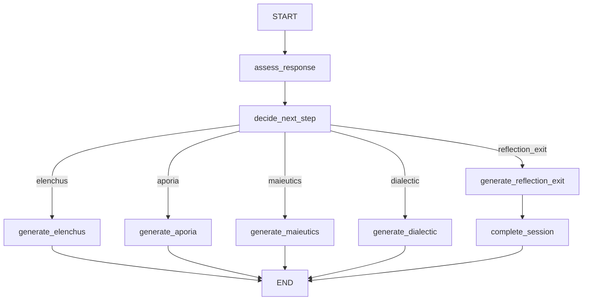

# Socratic Agentic AI Tutor

A research prototype exploring how an agentic AI system can support **Socratic learning and critical thinking** through structured, multi-stage dialogue.

This repository is an experimental second-generation implementation of an earlier Socratic tutor project. The current version uses **LangGraph** to orchestrate a set of Socratic reasoning phases behind a web-based tutoring interface.

> **Status:** Active research prototype. The architecture, prompts, instrumentation, persistence layer, and experimental design are still evolving and should not be considered production-ready.

## Research Goal

The project investigates whether an AI tutoring system grounded in the Socratic method can encourage learners to question assumptions, examine contradictions, refine arguments, and reflect on their own reasoning rather than simply receive answers from an LLM.

The broader research effort is focused on both:

- the **system design** of an agentic Socratic tutor; and
- the **evaluation of learner reasoning and critical-thinking outcomes** across experimental conditions.

A key design principle is to keep the human learner at the center of the reasoning process. The system should primarily **question, probe, and scaffold**, rather than solve the problem on the learner's behalf.

## Current Architecture

The current prototype separates the web application from the agentic tutoring workflow. Each student message is one LangGraph run. Phase generation is currently scripted from `PHASE_CONTENT` (LLM-backed nodes are planned, not wired).

```mermaid
flowchart LR
  learner [Learner]
  ui [React / Vite]
  api [FastAPI]
  graph [LangGraph]
  content [PHASE_CONTENT]

  learner --> ui
  ui -->|"GET /tutor/start\nPOST /tutor/message"| api
  api -->|invoke| graph
  graph --> content


```



Sessions start in **elenchus**. If the student hedges and attempts remain, the next turn stays in the same phase; otherwise the graph advances `elenchus → aporia → maieutics → dialectic → reflection_exit`. Staying in a phase is a later HTTP turn, not a back-edge in this graph. Session state is in-memory and is lost on restart.

```mermaid
flowchart TD
    UI["User Interface\nReact · TypeScript · Axios"]
    API["REST API\nFastAPI"]
    ORCH["Agentic Orchestration\nLangGraph"]
    LLM["LLM Provider\nOpenAI"]
    DB["Application Database\nSupabase · PostgreSQL"]
    OTEL["Telemetry\nOpenTelemetry"]
    LS["Tracing and Evaluation\nLangSmith Studio"]

    UI <-->|HTTP requests and responses| API
    API <-->|Tutor state and actions| ORCH
    ORCH <-->|Prompts and responses| LLM
    ORCH <-->|Session and learning data| DB

    API -.->|Metrics and traces| OTEL
    ORCH -.->|Metrics and traces| OTEL
    ORCH -.->|Workflow inspection| LS


    classDef interface fill:#e8f1ff,stroke:#2563eb,color:#111827,stroke-width:2px
    classDef service fill:#ecfdf5,stroke:#059669,color:#111827,stroke-width:2px
    classDef intelligence fill:#f5f3ff,stroke:#7c3aed,color:#111827,stroke-width:2px
    classDef data fill:#fff7ed,stroke:#ea580c,color:#111827,stroke-width:2px
    classDef observability fill:#f8fafc,stroke:#64748b,color:#111827,stroke-width:1.5px

    class UI interface
    class API service
    class ORCH,LLM intelligence
    class DB data
    class OTEL,LS observability
    
### Socratic Phases

The prototype currently represents the tutoring flow using the following conceptual phases:

| Phase | Purpose |
| --- | --- |
| **Aporia** | Surface uncertainty, assumptions, or gaps in the learner's current reasoning. |
| **Elenchus** | Probe claims and test them for contradictions or unsupported assumptions. |
| **Maieutics** | Help the learner develop and articulate ideas through guided questioning. |
| **Dialectic** | Examine alternative perspectives and refine the learner's argument through dialogue. |
| **Reflection / Exit** | Encourage metacognition and consolidate what changed in the learner's reasoning. |

These definitions and prompts are **not yet final**. A current research priority is grounding each phase's behavior, persona, and tool access in published Socratic-method literature rather than relying on informal interpretation.

## Agent vs. Tool Design

The research team is currently exploring a deliberately constrained agent architecture.

The working direction is:

- use distinct agents or phase behaviors only where there is a meaningful **Socratic conceptual/persona distinction**;
- avoid creating separate agents for ordinary orchestration or utility tasks; and
- implement capabilities such as topic extraction, summarization, reflection support, and next-step identification as **tools** when a separate persona is unnecessary.

This keeps the experimental architecture interpretable and avoids unnecessary multi-agent complexity.

## Technology Stack

### Backend

- Python
- FastAPI
- LangGraph
- LangChain
- OpenAI API
- Pydantic
- SQLAlchemy / PostgreSQL support
- LangGraph PostgreSQL checkpoint support
- Firebase Admin SDK (currently under evaluation for persistence)

### Frontend

- React
- Vite
- JavaScript

### Infrastructure / Observability Under Evaluation

The production research stack is not finalized. Current areas of investigation include:

- Firebase vs. Supabase for persistent research data
- PostgreSQL-based LangGraph checkpointing
- OpenTelemetry for application/request tracing
- Langfuse or LangSmith for LLM-specific observability
- Vercel for frontend hosting
- Render or Railway for backend hosting

The final data-collection deployment is expected to use appropriately provisioned paid infrastructure rather than relying on free-tier limits.

## Repository Structure

```text
socratic_agentic_ai/
├── app/
│   ├── api/           # FastAPI routes
│   ├── db/            # Persistence/database work
│   ├── graph/         # LangGraph state machine and nodes
│   │   ├── nodes/     # Socratic phase and routing nodes
│   │   ├── graph.py   # Graph construction and routing
│   │   └── state.py   # Tutor graph state
│   ├── models/        # Application/data models
│   ├── prompts/       # LLM/Socratic prompt definitions
│   ├── services/      # Supporting application services
│   └── main.py        # FastAPI application entry point
├── frontend/
│   ├── public/
│   └── src/           # React application
├── scripts/
├── .env.example
├── requirements.txt
└── README.md
```

## Getting Started

### Prerequisites

Install:

- Python 3.11+ recommended
- Node.js / npm
- an OpenAI API key

Database and Firebase configuration are only necessary for the parts of the prototype that use those services.

### 1. Clone the repository

```bash
git clone https://github.com/anissawilliams/socratic_agentic_ai.git
cd socratic_agentic_ai
```

### 2. Create a Python virtual environment

```bash
python -m venv .venv
source .venv/bin/activate
```

On Windows:

```powershell
.venv\Scripts\activate
```

### 3. Install backend dependencies

```bash
pip install -r requirements.txt
```

### 4. Configure environment variables

Copy the example environment file:

```bash
cp .env.example .env
```

At minimum, configure:

```env
OPENAI_API_KEY=your_openai_api_key
```

Additional variables in `.env.example` support PostgreSQL/LangGraph checkpointing and Firebase integration as those components are developed.

### 5. Start the FastAPI backend

From the repository root:

```bash
uvicorn app.main:app --reload
```

By default, FastAPI will be available at:

```text
http://localhost:8000
```

Interactive API documentation is typically available at:

```text
http://localhost:8000/docs
```

### 6. Start the frontend

In a second terminal:

```bash
cd frontend
npm install
npm run dev
```

Vite will print the local frontend URL when the development server starts.

## Current Development Priorities

The implementation is intentionally being kept flexible while the research design is finalized. Near-term priorities include:

1. **Ground Socratic behavior in literature**  
   Define canonical behavior, instructions, and boundaries for each Socratic phase using published research.

2. **Finalize the architecture diagram**  
   Document agents/phases, tools, routing, LLM calls, frontend/backend boundaries, storage, and observability before adding significant complexity.

3. **Define the research logging contract**  
   Determine exactly what must be captured before locking in the persistence implementation.

4. **Instrument learner interaction**  
   Candidate measures include complete conversation logs, timestamps, user response/pondering time, input length, and other interaction-level metrics needed for later analysis.

5. **Evaluate observability options**  
   Compare general tracing approaches such as OpenTelemetry with LLM-focused platforms such as Langfuse and LangSmith.

6. **Prepare for experimental deployment**  
   Harden persistence, hosting, monitoring, and recovery behavior before data collection begins.

## Research Data and Evaluation

The planned study is expected to compare the Socratic system with one or more alternative interaction conditions, potentially including a standard LLM control and/or a non-Socratic scaffolded tutoring condition.

Candidate evaluation approaches currently under investigation include:

- rubric-based argument quality
- assumption recognition
- counterfactual and objection generation
- consideration of opposing viewpoints
- stakeholder awareness
- reasoning consistency
- linguistic complexity
- interaction efficiency and response timing
- pre/post measures of reasoning or position development

The final metrics will be grounded in prior published research rather than created solely for this system.

## Research Prototype Disclaimer

This repository contains experimental research software.

The current implementation:

- is actively changing;
- has not been hardened for production use;
- does not yet represent the final experimental system;
- may contain provisional prompts, routing logic, schemas, or persistence code; and
- should not be used to draw research conclusions until the study design and implementation are finalized.

## Prior Work

This repository builds on an earlier Socratic chatbot implementation:

https://github.com/noghte/socratic_chatbot/

The current work is exploring a revised architecture using LangGraph, clearer orchestration boundaries, stronger research instrumentation, and a more rigorously defined Socratic methodology.

## Contributing

This repository currently supports an active academic research project. Architecture and implementation decisions may change as the research methodology is refined.

For collaborators, please coordinate design changes before significantly modifying agent behavior, data collection, or experimental logic so that implementation decisions remain aligned with the study design.

## License

No license has been specified yet.
