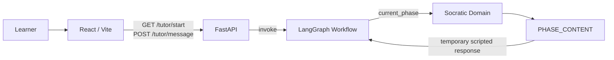
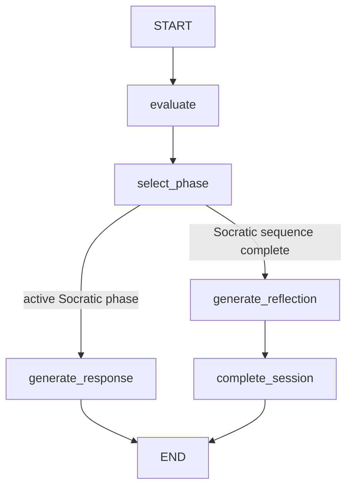
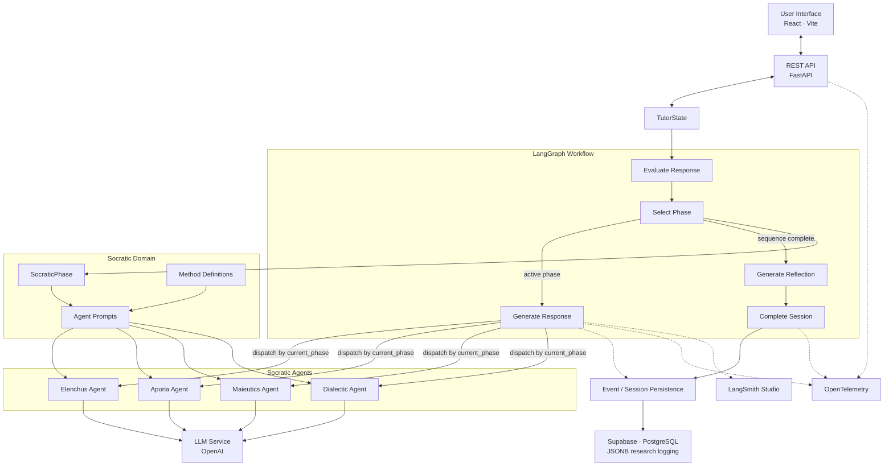

# Socratic Agentic AI Tutor

A research prototype exploring how an agentic AI system can support **Socratic learning and critical thinking** through structured, multi-stage dialogue.

This repository is an experimental second-generation implementation of an earlier Socratic tutor project. The current version uses **LangGraph** to orchestrate a stateful tutoring workflow behind a web-based interface, while keeping Socratic pedagogy separate from workflow orchestration.

> **Status:** Active research prototype. The architecture, prompts, instrumentation, persistence layer, and experimental design are still evolving and should not be considered production-ready.


## Research Goal

The project investigates whether an AI tutoring system grounded in the Socratic method can encourage learners to question assumptions, examine contradictions, refine arguments, and reflect on their own reasoning rather than simply receive answers from an LLM.

The broader research effort is focused on both:

- the **system design** of an agentic Socratic tutor; and
- the **evaluation of learner reasoning and critical-thinking outcomes** across experimental conditions.

A key design principle is to keep the human learner at the center of the reasoning process. The system should primarily **question, probe, and scaffold**, rather than solve the problem on the learner's behalf.

## Current Architecture

The current prototype separates **workflow operations** from **Socratic domain concepts**. Each student message is one LangGraph run. The graph evaluates the learner response, selects the Socratic phase that should govern the next intervention, and then generates either a Socratic response or the closing reflection.

Phase-specific generation nodes have been removed. The graph now has one `generate_response` node, and `TutorState.current_phase` determines the active Socratic behavior. Phase-specific generation nodes have been removed. The graph now has one `generate_response` node, and `TutorState.current_phase` determines which specialist Socratic agent handles the turn. Socratic response generation is LLM-backed; deterministic `PHASE_CONTENT` remains temporarily for session initialization and test fixtures.




### Current Routing Logic




The routing model intentionally separates four concerns:

- `evaluate` asks **what does the learner's response indicate?**
- `select_phase` asks **which Socratic phase should govern the next intervention?**
- `generate_response` asks **what should the tutor say under that phase?**
- graph routing asks **which computational step executes next?**

Sessions currently begin in **Elenchus**. If the learner hedges and attempts remain, the next turn stays in the same phase; otherwise the phase-selection policy advances through the current prototype sequence `Elenchus → Aporia → Maieutics → Dialectic`. The sequence is a current pedagogical policy rather than a structural constraint of the graph. When the Socratic sequence finishes, `current_phase` becomes `None`, the graph generates a closing reflection, and `complete_session` finalizes the session.

Session state is currently in memory and is lost on restart.

### Evolving Research Architecture

The intended architecture preserves four conceptually distinct Socratic agents while keeping them separate from LangGraph nodes. LangGraph owns workflow orchestration; `SocraticPhase` represents pedagogical state; the active phase will dispatch generation to the corresponding Socratic agent.




The key architectural distinction is:

- **LangGraph nodes** represent workflow operations and state transitions.
- **Socratic phases** represent pedagogical state.
- **Socratic agents** represent conceptually distinct LLM behaviors.
- **Tools and services** provide reusable capabilities and infrastructure without becoming additional agents.

## Socratic routing model

The current implementation uses a temporary linear routing policy in
`select_phase`: remain in the current phase or advance through a fixed
`PHASE_ORDER`.

This is an implementation scaffold, not the intended pedagogical model.

Elenchus, Aporia, Maieutics, and Dialectic are treated as complementary
Socratic modes rather than mandatory ordinal stages. Phase numbers are
used for organization, logging, and analysis; they should not determine
routing semantics.

The target architecture is non-linear and learner-state-driven:

- the router selects the pedagogical mode most appropriate to the
  learner's current reasoning state;
- the system may remain in a mode, revisit an earlier mode, skip a mode,
  or move toward synthesis/reflection when appropriate;
- Socratic agents perform their assigned pedagogical function but do not
  control progression.

Non-linear routing is intentionally deferred until structured
`ResponseEvaluation` is validated, so routing decisions can be grounded
in richer evidence than the current heuristic `hedging_detected` signal.

### Socratic Phases

The Socratic domain currently models four conceptual phases:


| Phase         | Purpose                                                                              |
| ------------- | ------------------------------------------------------------------------------------ |
| **Elenchus**  | Probe claims and test them for contradictions or unsupported assumptions.            |
| **Aporia**    | Surface uncertainty, contradiction, or gaps in the learner's current reasoning.      |
| **Maieutics** | Help the learner develop and articulate ideas through guided questioning.            |
| **Dialectic** | Examine alternative perspectives and refine the learner's argument through dialogue. |


**Reflection / Exit is not modeled as a Socratic phase.** It is a post-Socratic workflow step used to consolidate the learner's reasoning and close the session.

These definitions and prompts are **not yet final**. A current research priority is grounding each phase's behavior, persona, and boundaries in published Socratic-method literature rather than relying on informal interpretation.

## Agent vs. Tool Design

The research architecture deliberately limits agents to the four conceptually distinct Socratic components: **Elenchus, Aporia, Maieutics, and Dialectic**.

The working design principle is:

- use an **agent** when a component requires a distinct Socratic role, behavior, or persona;
- use a **LangGraph node** when the system needs a workflow operation or state transition;
- use a **tool** when the tutor needs a reusable domain capability such as retrieving course context or looking up supporting material; and
- use a **service** for infrastructure such as LLM invocation or Supabase connectivity.

The four agents are therefore not separate LangGraph nodes. The graph's `generate_response` node will dispatch to the appropriate Socratic agent using `TutorState.current_phase`.

This keeps the experimental architecture interpretable and avoids creating agents for ordinary orchestration or utility functions.


## Technology Stack


### Backend

- Python
- FastAPI
- LangGraph
- LangChain
- OpenAI API
- Pydantic
- Supabase / PostgreSQL planned for persistence and preliminary JSONB research logging


### Frontend

- React
- Vite
- JavaScript


### Infrastructure / Observability Under Evaluation

The production research stack is not finalized. Current areas of investigation include:

- Supabase / PostgreSQL for persistent session and research-event data
- PostgreSQL-based LangGraph checkpointing if persistent graph checkpoints are needed
- OpenTelemetry for application/request tracing
- LangSmith Studio and/or Langfuse for LLM-specific observability
- Vercel for frontend hosting
- Render or Railway for backend hosting

The final data-collection deployment is expected to use appropriately provisioned paid infrastructure rather than relying on free-tier limits.

## Repository Structure

```text
socratic_agentic_ai/
├── app/
│   ├── api/                   # FastAPI routes and request/response handling
│   ├── db/                    # Existing database stubs / transitional persistence code
│   ├── graph/                 # LangGraph workflow orchestration
│   │   ├── nodes/             # Workflow nodes: evaluate, select, generate, reflect, complete
│   │   ├── graph.py           # Graph construction / topology
│   │   ├── routing.py         # Conditional graph routing
│   │   └── state.py           # TutorState, TutorCondition, ResponseEvaluation
│   ├── models/                # Application/data-model stubs
│   ├── socratic/              # Socratic domain model
│   │   ├── phases.py          # SocraticPhase and current phase-order policy
│   │   ├── definitions.py     # Literature-grounded method definitions (in progress)
│   │   └── prompts.py         # Socratic prompt/content definitions
│   ├── services/              # Infrastructure services such as LLM / Supabase clients
│   ├── persistence/           # Event and session persistence boundaries
│   ├── tools/                 # Reusable tutor capabilities
│   └── main.py                # FastAPI application entry point
├── frontend/
│   ├── public/
│   └── src/                   # React application
├── scripts/
│   └── test_graph.py          # Graph smoke tests
├── .env.example
├── requirements.txt
└── README.md
```

As LLM-backed agents are implemented, the Socratic domain is expected to add an `agents/` package containing the four Socratic agent implementations.

## Getting Started


### Prerequisites

Install:

- Python 3.11+ recommended
- Node.js / npm
- an OpenAI API key

Database configuration is only necessary for prototype components that use persistence.

### 1. Clone the repository

```bash
git clone https://github.com/anissawilliams/socratic_agentic_ai.git
cd socratic_agentic_ai
```


### 2. Create a Python virtual environment

```bash
python -m venv .venv
source .venv/bin/activate
```

On Windows:

```powershell
.venv\Scripts\activate
```


### 3. Install backend dependencies

```bash
pip install -r requirements.txt
```


### 4. Configure environment variables

Copy the example environment file:

```bash
cp .env.example .env
```

At minimum, configure:

```env
OPENAI_API_KEY=your_openai_api_key
```

Additional environment variables will support Supabase/PostgreSQL persistence and observability as those components are implemented.

### 5. Start the FastAPI backend

From the repository root:

```bash
uvicorn app.main:app --reload
```

By default, FastAPI will be available at:

```text
http://localhost:8000
```

Interactive API documentation is typically available at:

```text
http://localhost:8000/docs
```


### 6. Start the frontend

In a second terminal:

```bash
cd frontend
npm install
npm run dev
```

Vite will print the local frontend URL when the development server starts.

## Current Development Priorities

The implementation is intentionally being kept flexible while the research design is finalized. Near-term priorities include:

1. **Ground Socratic behavior in literature**
  Define canonical behavior, instructions, and boundaries for each Socratic phase using published research.
2. **Implement the Socratic agent layer**
  Add the four LLM-backed Socratic agents while preserving the separation between pedagogical behavior and LangGraph orchestration.
3. **Define and implement the research logging contract**
  Add preliminary JSONB event logging and determine which interaction, routing, model, prompt, and timing fields must be captured for later analysis.
4. **Instrument learner interaction**
  Candidate measures include complete conversation logs, timestamps, user response/pondering time, input length, and other interaction-level metrics needed for later analysis.
5. **Evaluate observability options**
  Compare general tracing approaches such as OpenTelemetry with LLM-focused platforms such as Langfuse and LangSmith.
6. **Prepare for experimental deployment**
  Harden persistence, hosting, monitoring, and recovery behavior before data collection begins.


## Research Data and Evaluation

The planned study is expected to compare the Socratic system with one or more alternative interaction conditions, potentially including a standard LLM control and/or a non-Socratic scaffolded tutoring condition.

Candidate evaluation approaches currently under investigation include:

- rubric-based argument quality
- assumption recognition
- counterfactual and objection generation
- consideration of opposing viewpoints
- stakeholder awareness
- reasoning consistency
- linguistic complexity
- interaction efficiency and response timing
- pre/post measures of reasoning or position development

The final metrics will be grounded in prior published research rather than created solely for this system.

## Research Prototype Disclaimer

This repository contains experimental research software.

The current implementation:

- is actively changing;
- has not been hardened for production use;
- does not yet represent the final experimental system;
- may contain provisional prompts, routing logic, schemas, or persistence code; and
- should not be used to draw research conclusions until the study design and implementation are finalized.


## Prior Work

This repository builds on an earlier Socratic chatbot implementation:

[https://github.com/noghte/socratic_chatbot/](https://github.com/noghte/socratic_chatbot/)

The current work is exploring a revised architecture using LangGraph, clearer orchestration boundaries, stronger research instrumentation, and a more rigorously defined Socratic methodology.

## Contributing

This repository currently supports an active academic research project. Architecture and implementation decisions may change as the research methodology is refined.

For collaborators, please coordinate design changes before significantly modifying agent behavior, data collection, or experimental logic so that implementation decisions remain aligned with the study design.

## License

No license has been specified yet.